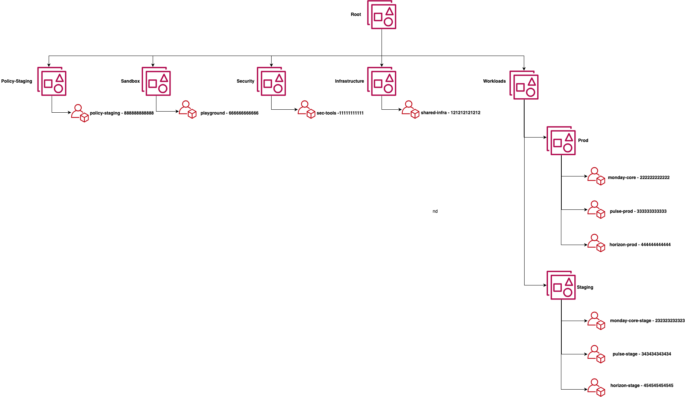
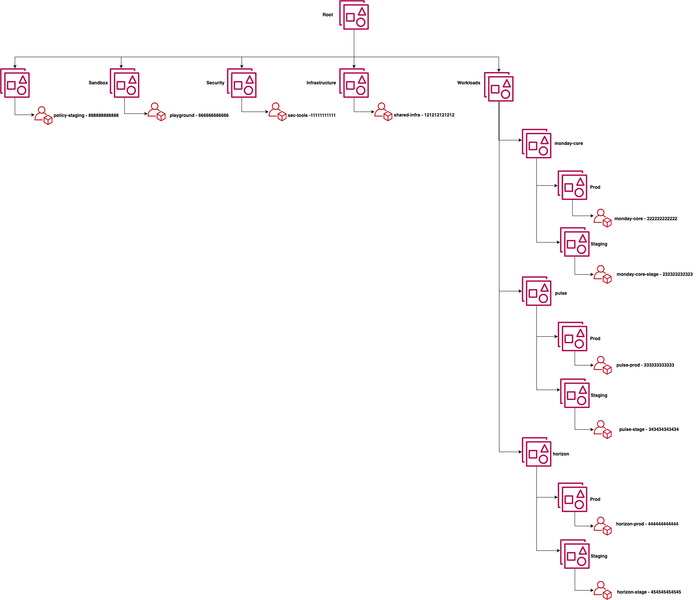

# 1. Service Control Policies (SCPs)

SCPs can be considered as a permissions boundary or what actions an IAM identities or a Roles are not allowed to do in the organization.
This allows us centrally set the limits/guardrails on actions that identities can perform regardless to the permissions assigned through the IAM Policies. They can be considered as a maximum set of actions allowed to be performed by an identity.
It's important to understand, they are not used to assign permissions, govern the configuration of resources or modify it in any way or shape.

# 2. OU Design

There are 2 alternative OU structures presented, Option A and Option B. This is not an exhaustive set of options, the OU structure can be very flexible and mainly driven by many factors such as SCPs, operational, type of workloads, regulations and compliance.

## 2.1 Option A

This option is **"Environment Driven"** and is using three-level OU nesting.

- Level0 - root
- Level1 - Infrastructure, Security, Workloads, Sandbox, Policy-Staging
- Level2 - Prod (shared) and Staging (shared)

This approach assumes that L1 OUs such as `Infrastructure` and `Security` don't have Dev/Staging environments and all the Workloads share the same `Staging` and `Prod` OUs.
Some of the benefits of such design are:

- Simplified OU structure
- Easier SCP troubleshooting
- Consistent governance across *all* workloads
- No duplication of policy logic
- Simple SCP rollout

Some of the tradeoffs are:

- Larger blast radius
- Less workload isolation
- Harder per-workload customization
- Exceptions are managed on the account level

*Figure1: Environment Driven OU structure*

### 2.2.1 root

Doesn't have any accounts except for the Management. Used to enforce very broad and simple "Deny" SPCs across the entire organization. In other words, "What must never happen in any account". Good candidates are:

- Prevent accounts from leaving the organization
- Protect CloudTrail
- Protect core security services
- Protect organization integrity

#### 2.2.1.1 Attached policies

- [`deny-leave-org.json`](policies/deny-leave-org.json)

### 2.3.1 Infrastructure

Contains shared/global infrastructure related accounts such as:

- Shared Services
- Networking
- Identity Platforms

#### 2.3.1.1 Attached Policies

- [`deny-disabling-cloudtrail.json`](policies/deny-disabling-cloudtrail.json)

### 2.4.1 Security

Contains security related accounts such as:

- Audit
- Logging
- Security tooling

#### 2.4.1.1 Attached Policies

- [`deny-disabling-cloudtrail.json`](policies/deny-disabling-cloudtrail.json)

### 2.5.1 Workloads

Doesn't have any accounts directly under the OU. Acts as top-level boundary for `Staging` and `Prod` OUs that contain actual applications.

#### 2.5.1.1 Attached Policies

- `none`

### 2.5.2 Staging

The Workload `Staging` OU contains a staging accounts for *all* the Workloads and fully represents the production. This is not a *playground* it's a production-like validation environment for real workloads under realistic governance.

In the context of SCPs, it's used to validate SCPs against *real* workloads and mirror production behavior. Here we should catch any integration and operational issues.
In essence, it serves as a *pre-production gate*.

#### 2.5.2.1 Attached Policies

- [`deny-disabling-cloudtrail.json`](policies/deny-disabling-cloudtrail.json)

### 2.5.3 Prod

The Workload `Pord` OU contains the production accounts for *all* the Workloads. This is where the real production applications are running. In the context of SCPs, it acts as an enforced governance boundary for all production workloads.

This is where the tested and validated policies become authoritative and fully enforced.
Some additional, production specific guardrails may apply here that are not required in the `Staging` OU.

#### 2.5.3.1 Attached Policies

- [`deny-disabling-cloudtrail.json`](policies/deny-disabling-cloudtrail.json)

- [`prod-guardrails.json`](policies/prod-guardrails.json) (example only)

### 2.6.1 Sandbox

This is an organization-wide (shared) `Sandbox` OU that contains accounts primarily used for *exploration* purposes and allows faster innovation and lower governance friction. Accounts that belong to this OU do not represent "real" workloads thus bring little realism.

#### 2.6.1.1 Attached Policies

- [`deny-disabling-cloudtrail.json`](policies/deny-disabling-cloudtrail.json)

### 2.7.1 Policy-Staging

This is a controlled environment to test SCP behavior in isolation before touching real workloads. It shouldn't be confused with `Sandbox` or Workload `Staging` OUs as this is a policy *testing lab*.
The main role of this OU is to validate the SCP logic and catch errors early.
In the context of a SCP rollout, this is a *first gate*. Here we can run synthetic tests to validate things such as:

- Did the deny trigger?
- Do conditions work?

This OU should contain 1-2 accounts but no *real* workloads.

NOTE: Tests completed here do *not* guarantee:

- It won’t break deployments
- It won’t affect real services

It only means that the policy behaves as defined.

## 2.2 Option B

This option is **"Workload Driven"** and has a dedicated `Staging` and `Prod` OUs per-workload. The OU structure is implemented by a four-level nesting.

- Level0 - root
- Level1 - Infrastructure, Security, Workloads, Sandbox, Policy-Staging
- Level2 - moday-code, pulse, hirizon
- Level3 - Staging, Prod (per-workload)

This alternative keeps the same L1 structure as the previous one. The main difference is that in this case the L2 is representing a specific workload/application with a dedicated Staging and Prod OUs at L3.

This approach have several advantages in case a stronger workload isolation is required.
The main benefits are:

- Easier exception handling
- Fine-grained control
- Reduced blast radius
- Independent policy evolution
- Delegated governance

The tradeoffs are:

- Policy attachment duplication
- More complex code
- Higher operational overhead
- More complex rollout

*Figure2: Workload Driven OU structure*

## 3. Rollout Process

The rollout process describes the lifecycle of a SCP from its initial creation to the state where it becomes an authoritative policy attached to the `Prod` OU.

`Policy-Staging → Staging → Prod`

Each step increases *realism* but also *blast radius* and *risk*.

### 3.1 Policy-Staging

The purpose is to validate policy correctness. The policy is attached to the `Policy-Staging` OU.
Here we validate:

- denied actions are actually blocked
- allowed actions still work
- conditions behave correctly
- no syntax/logic errors

We create a PR that changes or adds `policies/policy.json` and updates `scp-attachments.policy-staging.yaml`

### 3.2 Staging

The purpose is to validate real-world behavior. Same policy is attached to the `Staging` OU and affecting *all* the Dev/Staging workloads.
Here we validate:

- real applications
- real pipelines
- real service interactions

We create a PR with changes to `scp-attachments.staging.yaml`

### 3.3 Prod

The policy is enforced to *all* the production workloads. Same policy is attached to the `Prod` OU.

At this stage the policy becomes authoritative and affects *all* the production workloads.

We create a PR with changes to `scp-attachments.prod.yaml`